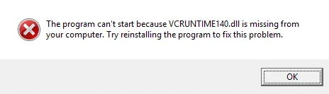

# dkml-workflows

GitHub Action workflows used by and with Diskuv OCaml (DKML) tooling. DKML helps you
distribute native OCaml applications on the most common operating systems.

## setup-dkml: Auto-generating GitHub releases for OCaml native executables

With setup-dkml you can build and automatically create releases of OCaml native executables.
In contrast to the conventional [setup-ocaml](https://github.com/marketplace/actions/set-up-ocaml) GitHub Action:

| `setup-dkml`                         | `setup-ocaml`       | Consequence                                                                                                                                                                                                                                                                                                |
| ------------------------------------ | ------------------- | ---------------------------------------------------------------------------------------------------------------------------------------------------------------------------------------------------------------------------------------------------------------------------------------------------------- |
| GitHub child workflow                | GitHub Action       | `setup-dkml` is more complex to configure, and takes longer to run                                                                                                                                                                                                                                         |
| MSVC + MSYS2                         | GCC + Cygwin        | On Windows `setup-dkml` can let your native code use ordinary Windows libraries without ABI conflicts. You can also distribute your executables without the license headache of redistributing or statically linking `libgcc_s_seh` and `libstdc++`                                                        |
| dkml-base-compiler                   | ocaml-base-compiler | On macOS, `setup-dkml` cross-compiles to ARM64 with `dune -x darwin_arm64`                                                                                                                                                                                                                                 |
| dkml-base-compiler                   | ocaml-base-compiler | `setup-dkml` only supports 4.12.1 today. `setup-ocaml` supports all versions and variants of OCaml                                                                                                                                                                                                         |
| CentOS 7 and Linux distros from 2014 | Latest Ubuntu       | On Linx, `setup-dkml` builds with an old GLIBC. `setup-dkml` dynamically linked Linux executables will be highly portable as GLIBC compatibility issues should be rare, and compatible with the unmodified LGPL license used by common OCaml dependencies like [GNU MP](https://gmplib.org/manual/Copying) |
| 0 yrs                                | 4 yrs               | `setup-ocaml` is officially supported and well-tested.                                                                                                                                                                                                                                                     |
| Some pinned packages                 | No packages pinned  | `setup-dkml`, for some packages, must pin the version so that cross-platform patches (especially for Windows) are available. With `setup-ocaml` you are free to use any version of any package                                                                                                             |

> Put simply, use `setup-dkml` when you are distributing executables or libraries to the public. Use `setup-ocaml` for all other needs.

`setup-dkml` will setup the following OCaml build environments for you:

| ABIs                       | Native `ocamlopt` compiler supports building executables for the following operating systems:                                            |
| -------------------------- | ---------------------------------------------------------------------------------------------------------------------------------------- |
| win32-windows_x86          | 32-bit Windows [1] for Intel/AMD CPUs                                                                                                    |
| win32-windows_x86_64       | 64-bit Windows [1] for Intel/AMD CPUs                                                                                                    |
| macos-darwin_all           | 64-bit macOS for Intel and Apple Silicon CPUs. Using `dune -x darwin_arm64` will cross-compile [2] to both; otherwise defaults to Intel. |
| manylinux2014-linux_x86    | 32-bit Linux: CentOS 7, CentOS 8, Fedora 32+, Mageia 8+, openSUSE 15.3+, Photon OS 4.0+ (3.0+ with updates), Ubuntu 20.04+               |
| manylinux2014-linux_x86_64 | 64-bit Linux: CentOS 7, CentOS 8, Fedora 32+, Mageia 8+, openSUSE 15.3+, Photon OS 4.0+ (3.0+ with updates), Ubuntu 20.04+               |

> **[1]** See [Distributing your Windows executables](#distributing-your-windows-executables) for further details

> **[2]** Cross-compiling typically requires that you use Dune to build all your OCaml package dependencies.
> [opam monorepo](https://github.com/ocamllabs/opam-monorepo#readme) makes it easy to do exactly that.
> Alternatively you can directly use [findlib toolchains](http://projects.camlcity.org/projects/dl/findlib-1.9.3/doc/ref-html/r865.html).

You will need three sections in your GitHub Actions `.yml` file to build your executables:

1. A `setup-dkml` workflow to create the above build environments
2. A "matrix build" workflow to build your OCaml native executables on each
3. A "release" workflow to assemble all of your native executables into a single release

### Job 1: Define the `setup-dkml` workflow

Add the `setup-dkml` child workflow to your own GitHub Actions `.yml` file:

```yaml
jobs:
  setup-dkml:
    uses: 'diskuv/dkml-workflows/.github/workflows/setup-dkml.yml@v0'
    with:
      ocaml-compiler: 4.12.1
```

`setup-dkml` will create an Opam switch containing an OCaml compiler based on the dkml-base-compiler packages.
Only OCaml `ocaml-compiler: 4.12.1` is supported today.

> **Advanced**
>
> The switch will have an Opam variable `ocaml-ci=true` that can be used in Opam filter expressions for advanced optimizations like:
>
> ```c
> [ "make" "rebuild-expensive-assets-from-scratch" ]    {ocaml-ci}
> [ "make" "download-assets-from-last-github-release" ] {!ocaml-ci}
> ```

### Job 2: Define a matrix build workflow

You can copy and paste the following:

```yaml
jobs:
  setup-dkml:
    # ...
  build:
    # Wait until `setup-dkml` is finished
    needs: setup-dkml

    # Five (5) build environments will be available. You can include
    # all of them or a subset of them.
    strategy:
      fail-fast: false
      matrix:
        include:
          - os: windows-2019
            abi-pattern: win32-windows_x86
            dkml-host-abi: windows_x86
            opam-root: D:/.opam
            default_shell: msys2 {0}
            msys2_system: MINGW32
            msys2_packages: mingw-w64-i686-pkg-config
          - os: windows-2019
            abi-pattern: win32-windows_x86_64
            dkml-host-abi: windows_x86_64
            opam-root: D:/.opam
            default_shell: msys2 {0}
            msys2_system: CLANG64
            msys2_packages: mingw-w64-clang-x86_64-pkg-config
          - os: macos-latest
            abi-pattern: macos-darwin_all
            dkml-host-abi: darwin_x86_64
            opam-root: /Users/runner/.opam
            default_shell: sh
          - os: ubuntu-latest
            abi-pattern: manylinux2014-linux_x86
            dkml-host-abi: linux_x86
            opam-root: .ci/opamroot
            default_shell: sh
          - os: ubuntu-latest
            abi-pattern: manylinux2014-linux_x86_64
            dkml-host-abi: linux_x86_64
            opam-root: .ci/opamroot
            default_shell: sh

    runs-on: ${{ matrix.os }}
    name: build-${{ matrix.abi-pattern }}

    # Use a Unix shell by default, even on Windows
    defaults:
      run:
        shell: ${{ matrix.default_shell }}

    steps:
      # Checkout your source code however you'd like. Typically it is:
      - name: Checkout
        uses: actions/checkout@v3

      - name: Install MSYS2 to provide Unix shell (Windows only)
        if: startsWith(matrix.dkml-host-abi, 'windows')
        uses: msys2/setup-msys2@v2
        with:
          msystem: ${{ matrix.msys2_system }}
          update: true
          install: >-
            ${{ matrix.msys2_packages }}
            wget
            make
            rsync
            diffutils
            patch
            unzip
            git
            tar

      - name: Download setup-dkml artifacts
        uses: actions/download-artifact@v3
        with:
          path: .ci/dist

      - name: Import build environments from setup-dkml
        run: |
          ${{ needs.setup-dkml.outputs.import_func }}
          import ${{ matrix.abi-pattern }}

      - name: Cache Opam downloads by host
        uses: actions/cache@v3
        with:
          path: ${{ matrix.opam-root }}/download-cache
          key: ${{ matrix.dkml-host-abi }}

      # >>>>>>>>>>>>>
      # You can customize the next two steps!
      # >>>>>>>>>>>>>

      - name: Use opamrun to build your executable
        run: |
          #!/bin/sh
          set -eufx
          opamrun install . --with-test --deps-only --yes
          opamrun exec -- dune build @install

          # Package up whatever you built
          mkdir dist
          tar cvfCz dist/${{ matrix.abi-pattern }}.tar.gz _build/install/default .

      - uses: actions/upload-artifact@v3
        with:
          name: ${{ matrix.abi-pattern }}
          path: dist/${{ matrix.abi-pattern }}.tar.gz
```

The second last GitHub step ("Use opamrun to build your executable") should be custom to your application.

### Job 3: Define a release workflow

You can copy and paste the following:

```yaml
jobs:
  setup-dkml:
    # ...
  build:
    # ...
  release:
    runs-on: ubuntu-latest
    # Wait until `build` complete
    needs:
      - build
    steps:
      - uses: actions/download-artifact@v3
        with:
          path: dist

      - name: Remove setup artifacts
        run: rm -rf setup-*
        working-directory: dist

      - name: Display files downloaded
        run: ls -R
        working-directory: dist

      # >>>>>>>>>>>>>
      # You can customize the next two steps!
      # >>>>>>>>>>>>>

      - name: Release (only when Git tag pushed)
        uses: softprops/action-gh-release@v1
        if: startsWith(github.ref, 'refs/tags/')
        with:
          files: |
            dist/*
```

### Distributing your executable

#### Distributing your Windows executables

Since your executable has been compiled with the Microsoft Visual Studio
Compiler (MSVC), your executable will require that the Visual Studio
Runtime (`vcruntime140.dll`) is available on your end-user's machine.

If your end-user recently purchased a Windows machine the Visual C++ Redistributable
will not be present; they would see the following if they tried to run your
executable:



`vcruntime140.dll` and other DLLs that are linked into your executable
by Visual Studio are available as part of the
[Visual C++ Redistributable Packages](https://docs.microsoft.com/en-us/cpp/windows/redistributing-visual-cpp-files).

As of April 2022 the Redistributable Packages only support Windows Vista, 7,
8.1, 10, and 11. Windows XP is **not** supported.

To get the Redistributable Packages onto your end-user's
machine, do one of the following:

1. Ask your end-user to download from one of the links on (Microsoft Visual C++ Redistributable latest supported downloads)[https://docs.microsoft.com/en-US/cpp/windows/latest-supported-vc-redist]. The end-user will need Administrator privileges.
2. Bundle your executable inside a standard Windows installer (NSIS, Wix, etc.). You can see NSIS instructions below. The end-user will need Administrator privileges.
3. Ask your user to download `vcruntime140.dll` and place it in the same
   directory as your executable. This is not recommended because Windows Update
   will not be able to apply any security updates to your locally deployed
   `vcruntime140.dll`.

---

If you choose option 2 and are using NSIS as your Windows installer, you can add
the following NSIS section to your NSIS configuration:

```nsis
Section "Visual C++ Redistributable Packages"
  SetOutPath "$INSTDIR"
  !include "x64.nsh"
  ${If} ${IsNativeAMD64}
    File "C:\Program Files (x86)\Microsoft Visual Studio\2019\Community\VC\Redist\MSVC\14.29.30133\vc_redist.x64.exe"
    ExecWait '"$INSTDIR\vc_redist.x64.exe" /install /passive'
    Delete "$INSTDIR\vc_redist.x64.exe"
  ${ElseIf} ${IsNativeARM64}
    File "C:\Program Files (x86)\Microsoft Visual Studio\2019\Community\VC\Redist\MSVC\14.29.30133\vc_redist.arm64.exe"
    ExecWait '"$INSTDIR\vc_redist.arm64.exe" /install /passive'
    Delete "$INSTDIR\vc_redist.arm64.exe"
  ${ElseIf} ${IsNativeIA32}
    File "C:\Program Files (x86)\Microsoft Visual Studio\2019\Community\VC\Redist\MSVC\14.29.30133\vc_redist.x86.exe"
    ExecWait '"$INSTDIR\vc_redist.x86.exe" /install /passive'
    Delete "$INSTDIR\vc_redist.x86.exe"
  ${Else}
    Abort "Unsupported CPU architecture!"
  ${EndIf}
SectionEnd
```

When you run the `makensis.exe` NSIS compiler the specified `File` must be
present on the `makensis.exe` machine. Make sure you have set it correctly!
If the NSIS compiler is running
as part of the GitHub Actions, you can
look at the output of setup-dkml.yml's step
"Capture Visual Studio compiler environment (2/2)"; the directory will be
the `VCToolsRedistDir` environment variable. The `VCToolsRedistDir` environment
variable will also be available to use as
`opamrun exec -- sh -c 'echo $VCToolsRedistDir'`
